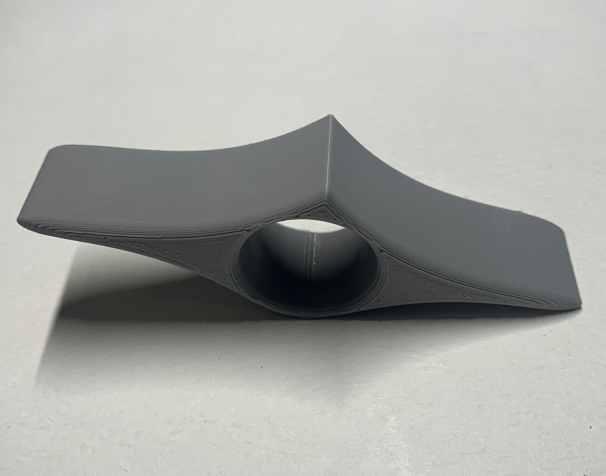

<!--- 
Open Source Assistive Technology: GitHub Readme Template
 --->

<!---
INSTRUCTIONS
This is a markdown template for creating the README.md file in a GitHub repository. This file is rendered and displayed automatically when someone visits the repository.

This document includes helper text that will not be displayed when rendered. Any text between the less-than sign + exclamation mark + three hyphen-minus (<!---) and matching three hyphen-minus + greater-than sign will not be displayed. This helper text can be deleted once the corresponding section is completed.

 --->
 
 <!--- 
TITLE
Should match the name of the GitHub repository. Choose something descriptive rather than whimsical. 
 --->
 # One Handed Book Holder

<!--- 
SUMMARY
A brief summary of the project. What it does, who it is for, how much it costs.
 --->
The One Handed Book Holder is an inexpensive 3D printed device that makes it easier to hold the pages of a book open with only one hand. Users with limited hand dexterity or use of only one hand my find this device beneficial.  

<!--- 
PHOTO

 --->

## More info at
 - [Makers Making Change Forum Thread](TBD) 
 - [Makers Making Change Project Page](TBD)

## How to Obtain a One Handed Book Holder
### 1. Do it Yourself (DIY) or Do it Together (DIT)

This is an open-source assistive technology, so anyone is free to build it. All of the files and instructions required to build a One Handed Book Holder are contained within this repository. Refer to the Maker Checklist below.

### 2. Request a build of this device

If you would like to obtain a One Handed Book Holder, you may submit a build request through the [MMC Library Page](https://makersmakingchange.com/project/one-handed-book-holder/). The requestor is responsible for the cost of materials and any shipping.

### 3. How to build this device for someone else

If you have the skills and equipment to build this device, and would like to donate your time to create this device for someone who needs it, visit the [MMC Maker Wanted](https://makersmakingchange.com/maker-wanted/) section.

## Getting Started
<!--- 
Include an overall idea of what major steps are required to build the device.
 --->

### 1. Print the 3D Printable components

All of the files and individual print files can be in the [/Build_Files/3D_Printing_Files](/Build_Files/3D_Printing_Files/) folder.

## Files
<!---
FILES
This section includes all the information and files required to build and modify the device, including documentation, design files, and build files. 
--->

### Documentation
<!---
DOCUMENTATION

--->
| Document | Version | Link |
|----------|---------|------|
| Design Specifications| 1.0 | [One_Handed_Book_Holder_Design_Specifications](/Documentation//Working_Files/One_Handed_Book_Holder_Design_Rationale.pdf) |
| Design Rationale     | 1.0 | [One_Handed_Book_Holder_Design_Rationale](/Documentation/One_Handed_Book_Holder_Design_Rationale.pdf) |
| Bill of Materials    | 1.0 | [One_Handed_Book_Holder_BOM](/Documentation/One_Handed_Book_Holder_BOM.xlsx) |
| Assembly Guide       | N/A | No Assembly Required
| Maker Checklist      | 1.0 | [One_Handed_Book_Holder_Checklist](/Documentation/One_Handed_Book_Holder_Maker_Checklist.pdf) |
| User Guide           | 1.0 | [ProjectTitle_Quick_Guide](/Documentation/One_Handed_Book_Holder_User_Guide.pdf)           |
| Changelog            | 1.0 | [One_Handed_Book_Holder_Changelog](/Documentation/One_Handed_Book_Holder_Changelog.pdf)               |

### Design Files
<!---
DESIGN FILES
If possible, include a copy of original design files to facilitate easy editing and customization.
--->
Not available 

### Build Files
<!---
BUILD FILES
This section i
--->
 - [3D Printing Files](/Build_Files/3D_Printing)

## License
<!---
LICENSE
Choose an appropriate license. We recommend an open-source hardware compatible license.
--->
Everything needed or used to design, make, test, or prepare the One Handed Book Holder is licensed under the CERN 2.0 Permissive license <https://ohwr.org/project/cernohl/wikis/Documents/CERN-OHL-version-2> (CERN-OHL-P).

Accompanying material such as instruction manuals, videos, and other copyrightable works that are useful but not necessary to design, make, test, or prepare the One Handed Book Holder are published under a Creative Commons Attribution-ShareAlike 4.0 license <https://creativecommons.org/licenses/by-sa/4.0/> (CC BY-SA 4.0).

## Attribution
<!---
ATTRIBUTION
Include any information related to the development of the design. This may include who identified the initial challenge, who contributed to the design
--->
Design by [Mathis](https://www.myminifactory.com/users/mgigli) and posted on [MyMiniFactory](https://www.myminifactory.com/object/3d-print-one-hand-book-holder-41414)

Documentation by Makers Making Change

The documentation template was created by Makers Making Change and is used under a CC BY-SA 4.0 license. It is available at the following link: https://github.com/makersmakingchange/OpenAT-Template

## About Makers Making Change

Makers Making Change is an initiative of [Neil Squire](https://www.neilsquire.ca/), a Canadian non-profit that uses technology, knowledge, and passion to empower people with disabilities.

We are committed to cultivating a network of volunteer makers who support people with disabilities in their communities through cost effective assistive technology. Check out our library of free, open-source assistive technologies.

 - Website: [www.MakersMakingChange.com](https://www.makersmakingchange.com/)
 - [GitHub](https://github.com/makersmakingchange)
 - [Thingiverse](https://www.thingiverse.com/makersmakingchange/about)
 - Twitter: [@makermakechange](https://twitter.com/makermakechange)
 - Instagram: [@makersmakingchange](https://www.instagram.com/makersmakingchange)

### Contact Us
For technical questions, to get involved, or to share your experience we encourage you to visit [MMC Forum](https://forum.makersmakingchange.com) or contact info@makersmakingchange.com
